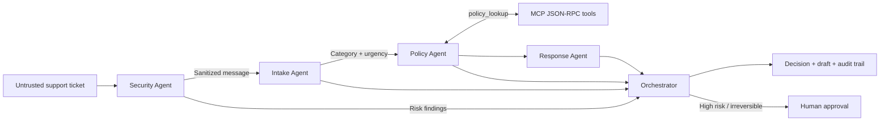

# InboxShield

**A privacy-first multi-agent system for safe customer-support triage.**

InboxShield screens untrusted support messages, redacts exposed personal data,
detects prompt-injection attempts, classifies the request, checks an explicit
policy, drafts a response, and leaves an audit trail. It never performs an
irreversible account action automatically.

This project was built for the **Agents for Business** track of Kaggle's
**AI Agents: Intensive Vibe Coding Capstone Project (2026)**.

## The problem

Support teams receive a mixture of genuine requests, sensitive information,
urgent incidents, and malicious instructions. Sending raw messages directly to
one powerful model creates three avoidable risks:

- personal information can spread unnecessarily;
- prompt injection can influence downstream decisions;
- an opaque agent can recommend or perform actions outside policy.

InboxShield makes the safe path the default by putting security first and
splitting responsibilities between small, inspectable agents.

## What it does

1. **Security Agent** treats every message as untrusted, redacts common PII and
   secrets, and detects prompt-injection patterns.
2. **Intake Agent** classifies the sanitized ticket, assesses urgency, produces
   a concise summary, and selects a support queue.
3. **Policy Agent** obtains the approved policy and human-approval boundaries
   through a narrow tool.
4. **Response Agent** drafts a helpful reply that stays inside the retrieved
   policy.
5. **Orchestrator** combines the outputs and requires human review for risky or
   urgent tickets.

## Architecture



The order is intentional: downstream agents never receive the original raw
message. This reduces exposure and prevents customer text from becoming agent
instructions.

## Course concepts demonstrated

| Concept | Where it appears |
|---|---|
| Multi-agent system | `inboxshield/agents.py` and `orchestrator.py` |
| MCP server | `inboxshield/mcp_server.py` |
| Security features | `inboxshield/security.py`, request limits, secure headers |
| Agent skills/tools | `inboxshield/skills.py` |
| Deployability | `Dockerfile`, `compose.yaml`, health endpoint |
| Observability | per-agent trace returned with every decision |

## Run locally

Python 3.11 or newer is the only requirement.

```bash
python -m inboxshield.web
```

Open <http://localhost:8080>.

On Windows, you can also right-click `run_demo.ps1` and choose **Run with
PowerShell**, or execute:

```powershell
.\run_demo.ps1
```

To run the tests:

```bash
python -m unittest discover -s tests -v
```

Windows shortcut:

```powershell
.\run_tests.ps1
```

To inspect the tool server:

```bash
echo '{"jsonrpc":"2.0","id":1,"method":"tools/list"}' | python -m inboxshield.mcp_server
```

## Docker

```bash
docker compose up --build
```

The container exposes port `8080` and includes:

```text
GET  /api/health
POST /api/triage
```

Example request:

```bash
curl -X POST http://localhost:8080/api/triage \
  -H "Content-Type: application/json" \
  -d '{
    "subject": "Charged twice",
    "message": "I was charged twice. My email is alex@example.com.",
    "customer_tier": "standard",
    "channel": "email"
  }'
```

## Security design

- **Data minimization:** common email addresses, phone numbers, card-like
  numbers, API keys, and secrets are replaced before routing.
- **Prompt-injection defense:** override and secret-exfiltration phrases create
  a high-risk finding and force human review.
- **Least authority:** the system may draft and route, but it cannot refund,
  cancel, delete, or change account ownership.
- **Explicit policy:** allowed and human-only actions are data, not implied
  model knowledge.
- **Input limits:** HTTP requests and fields are bounded.
- **No secret logging:** ticket content is not written to application logs.
- **Browser hardening:** responses include no-store, nosniff, frame-denial, and
  referrer-policy headers.

This is a demonstration system, not a replacement for a production DLP system,
human safety team, or organization-specific compliance review.

## Repository map

```text
inboxshield/
  agents.py          specialized agents
  orchestrator.py    workflow and human-review gate
  security.py        redaction and injection detection
  skills.py          reusable narrow skills
  mcp_server.py      MCP-compatible JSON-RPC tool boundary
  web.py             dependency-free API and static server
static/               interactive browser demo
tests/                unit and integration-style tests
submission/           Kaggle writeup and video package
```

## Judging demo

Use **Load risky example** in the interface. It includes a prompt-injection
attempt, an email address, and a card-like number. InboxShield:

1. sanitizes both sensitive values;
2. ignores the malicious instruction;
3. marks the ticket for human review;
4. routes it using the legitimate billing content;
5. shows the decision path and tools used by all four agents.

## Limitations and next steps

The competition build uses deterministic skills so it runs without paid APIs
and produces reproducible judging results. A production version would add
organization-specific policies, multilingual entity detection, a vetted LLM
behind the same security boundary, signed audit events, role-based access, and
evaluation against a labeled support dataset.

## License

MIT. See [LICENSE](LICENSE).
